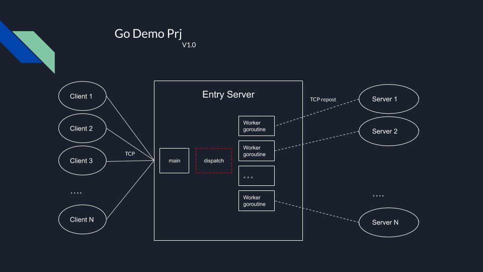

## 1. 目标
学习go，并使用go编写
1. 客户端C
2. 中转服务器S
3. 计算服务器（集群），简单计算，loopback原样返回

初步设计，框架如下所示

注意事项：
1. 并发性能
2. 代码规范(ref PCG go 编程规范)

## 2. 基本思路
1. 接入服务器做流量控制和TCP转发（不做任何处理）
2. 接入服务器可以用goroutine做并发
3. 接入服务器可以用go的通信机制？多进程？待测试和学习
4. 接入服务器负载均衡采用轮询的形式（为了简化，不采用权重和状态采集）
4. 计算服务器单纯的做计算
5. 计算内部用goroutine做并发

## 3. 步骤和计划
1. 【DONE】熟悉go基础语法，绘制[思维导图](./go_xmind.pdf)
2. 【DONE】编写简单的CS socket代码 [simple_client.go](./simple_client.go) [simple_server.go](./simple_server.go) ，支持并发通信，测试效果 
3. 【DONE】编写TCP反向代理服务器 [simple_tcp_repost.go](./simple_tcp_repost.go) 和计算服务器  [simple_server.go](./simple_server.go)  
	1. 暂时支持单计算节点，还没添加集群节点
4. 【DONE】调通整个链路，效果如图 
5. 【TODO】支持多节点集群
6. 【TODO】优化服务器端代码，提高并发性能（job缓存，任务队列）
7. 【TODO】测试现有go并发框架(chitchat and nginx)

## 4. 说明
1. 查阅很多资料后，发现这个设计架构类似nginx四层架构，TCP反向代理
为了简化计算，先假设
   1. 集群的数量是固定的，IP也是固定的，手工分配
   2. 简化负载均衡算法：找到空闲server，然后将TCP数据流转发到这个server
