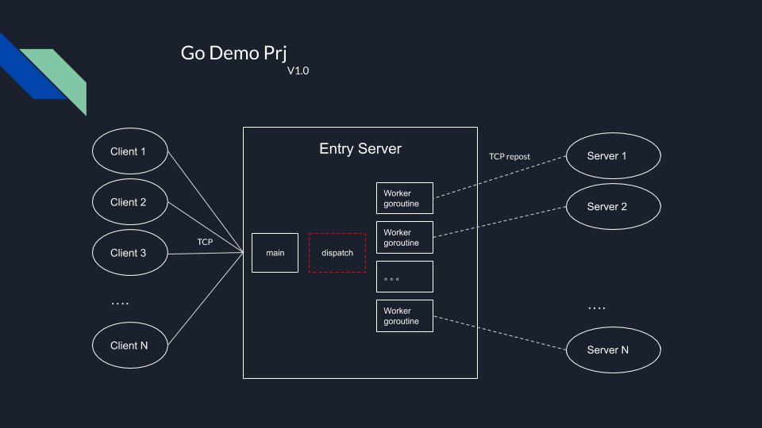
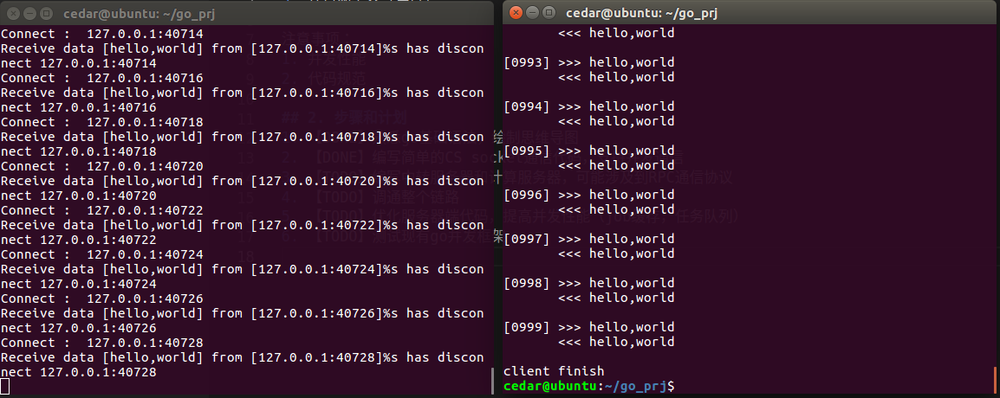
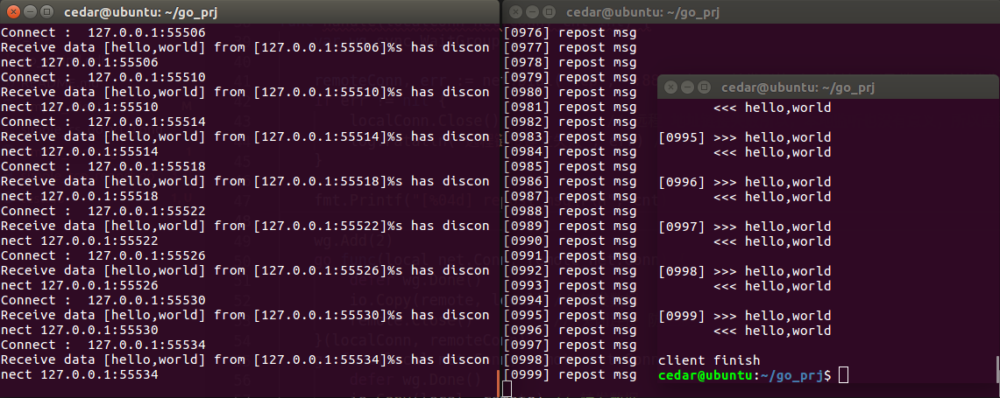
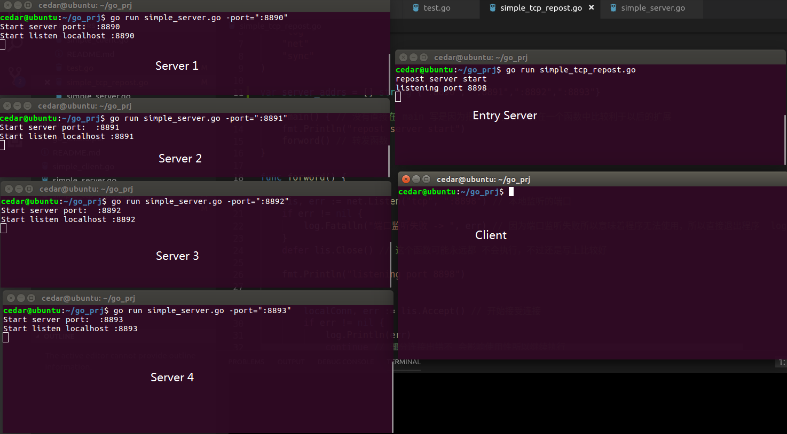
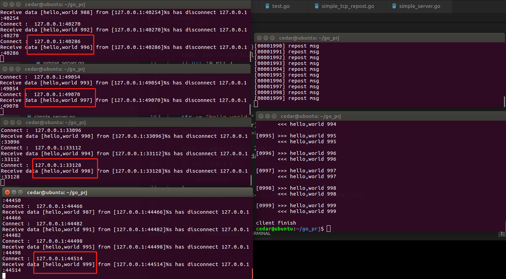

## 1. 目标
学习go，并使用go编写
1. 客户端C
2. 中转服务器S
3. 计算服务器（集群），简单计算，loopback原样返回

初步设计，框架如下所示


注意事项：
1. 并发性能
2. 代码规范(ref PCG go 编程规范)

## 2. 基本思路
1. 接入服务器做流量控制和TCP转发（不做任何处理）
2. 接入服务器可以用goroutine做并发
3. 接入服务器可以用go的通信机制？多进程？待测试和学习
4. 接入服务器负载均衡采用轮询的形式（为了简化，不采用权重和状态采集）
4. 计算服务器单纯的做计算
5. 计算内部用goroutine做并发


## 3. 步骤和计划
1. **【<font color=blue>DONE</font>】** 熟悉go基础语法，绘制[思维导图](./go_xmind.pdf)
2. **【<font color=blue>DONE</font>】** 编写简单的CS socket代码 [simple_client.go](./simple_client.go) [simple_server.go](./simple_server.go) ，支持并发通信，测试效果 
3. **【<font color=blue>DONE</font>】** 编写TCP反向代理服务器 [simple_tcp_repost.go](./simple_tcp_repost.go) 和计算服务器  [simple_server.go](./simple_server.go)  
4. **【<font color=blue>DONE</font>】** 调通整个链路，效果如图 
5. **【<font color=blue>DONE</font>】** 支持多节点集群
	1. 暂时支持4个服务器节点，在本地部署，分别监听8890, 8891, 8892, 8893端口，如图 
	2.  当前服务器分配的方式，采用轮询分配的方式，依次将包转发给1-2-3-4服务器，如图 
	3.  服务器端的代码，采用flag命令解析指定监听端口
6. **【<font color=blue>DONE</font>】** 优化服务器端代码，提高并发性能（job缓存，任务队列）
	1.  nginx的核心并发原理是：多个worker进程+异步IO事件，同时采用锁机制，避免同时唤醒多个进程
	2.  在计算服务器上，采用类似原理，发送消息通知到worker任务队列
	3.  每个计算server最大worker数量是20W，简单echo测试OK
	4.  【TODO】待优化中转代理服务器代码
	5.  核心代码如下
``` go
// ------ job & worker arch ------

type Job interface {
	Do()
}

type Worker struct {
	JobQueue chan Job
}

func NewWorker() Worker {
	return Worker{JobQueue: make(chan Job)}
}

func (w Worker) Run(wq chan chan Job) {
	go func() {
		for {
			wq <- w.JobQueue
			select {
			case job := <-w.JobQueue:
				job.Do()
			}
		}
	}()
}

type WorkerPool struct {
	workerlen   int
	JobQueue    chan Job
	WorkerQueue chan chan Job
}

func NewWorkerPool(workerlen int) *WorkerPool {
	return &WorkerPool{
		workerlen:   workerlen,
		JobQueue:    make(chan Job),
		WorkerQueue: make(chan chan Job, workerlen),
	}
}

func (wp *WorkerPool) Run() {
	fmt.Println("init worker")
	for i := 0; i < wp.workerlen; i++ {
		worker := NewWorker()
		worker.Run(wp.WorkerQueue)
	}

	go func() {
		for {
			select {
			case job := <-wp.JobQueue:
				worker := <-wp.WorkerQueue
				worker <- job
			}
		}
	}()
}
```
	
7. **【<font color=red>TODO</font>】** 测试现有go并发框架(chitchat and nginx)


## 4. 说明
1. 查阅很多资料后，发现这个设计架构类似nginx四层架构，TCP反向代理
为了简化计算，先假设
   1. 集群的数量是固定的，IP也是固定的，手工分配
   2. 简化负载均衡算法：找到空闲server，然后将TCP数据流转发到这个server

